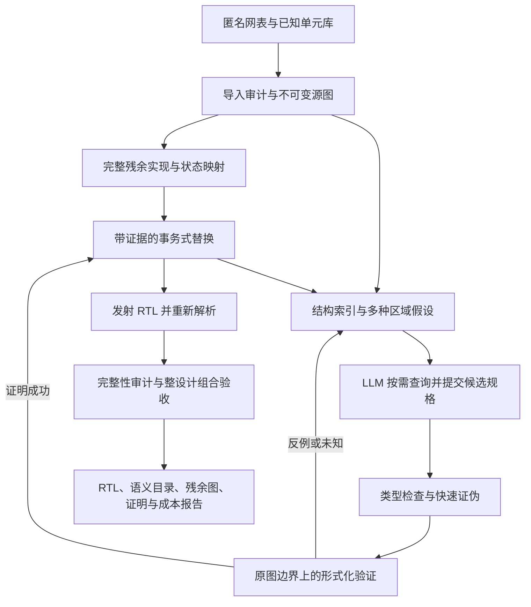

# DeSynth Harness v2：面向匿名网表的可验证语义恢复

状态：**架构提案，尚未实现**。2026-09-18。依据：[现状与工具调研](HARNESS_RESEARCH_2026-09-18.md)。

## 1. 研究对象与交付定义

我们恢复的是与匿名输入电路等价、具有更多可解释结构的 RTL，不承诺恢复唯一的原始源码。综合是多对一映射，原始变量名、层次、循环写法乃至部分模块边界通常不可唯一识别。

目标分为三个独立维度：

- **完整性**：每个原始状态位、输出位和外部可见作用都有实现与来源；没有人为补 X/0、丢弃状态或未建模单元。
- **正确性**：最终实际发射 RTL 在明确的 cell、初态、时钟/复位和环境模型下与输入网表等价。局部证明不自动等于整设计证明。
- **语义恢复**：经过证明的字级算子、带条件的状态更新、FSM 转移、寄存器组和模块契约增加；未解释逻辑减少。改名或格式化不算语义恢复。

输出可以是“高级 RTL + 精确保留的残余逻辑”。这允许完整、正确但只部分理解的结果存在；它绝不等于“全部高层语义都恢复了”。报告必须同时给 correctness 和 semantic coverage，复制原网表只能得到零新增语义的基线。

## 2. 最重要的架构选择：从完整实现开始



核心不变量：**任何候选失败、超时、模型调用失败或中断，都不会让当前已接受电路丢失原功能。** 保留完整 gate DAG 不需要先展开每个锥的布尔表达式。下一状态公式提取可以按需进行、可以失败；源图不能因此消失。

首个基线是无 LLM 的 lossless import/export。在支持范围内，残余组合逻辑可写成共享 `assign` DAG，状态保留原事件模型；不能可靠转成行为模型的已知单元，保留实例和准确模型并标注残余。未知语义单元可归档，但不能获得 whole-design verified verdict。

## 3. 数据层：共享图、候选层、证据层

### 3.1 不可变源图

保留 `Cell / Pin / Bit / Port / State / Memory / ClockEvent`、方向、驱动和负载、常量、单元参数、库语义 hash、源输入 hash。状态记录实际 clock/edge、同步或异步 reset/set、极性/优先级、enable、初态和 unknown 语义。库名字是合法建模信息；设计名不是。

门图/表达式使用共享 DAG，跨输出复用，不构造 MB 级重复字符串。HAL 负责结构视图，Yosys RTLIL/JSON 负责归一化和编译，AIG/SMT 是验证视图；无需从第一天重新实现这些引擎。

统一映射是我们的责任：HAL id、Yosys bit id、AIG interface position 是不同命名空间。用显式 map artifact 对接，禁止靠名字或相同整数猜对应关系。ABC 优化后内部节点可能不存在一一对应；至少保证每个证明边界的输入/输出及极性绑定，无法追踪的内部映射不得伪造。

匿名化在导入前完成：去掉原层次/名字/文件名/注释/`src` 属性；打乱实例顺序和内部 ID。恢复进程只见随机 opaque ID，不能见原始映射。是否保留端口 bus 形状、位序属于评测条件，应固定且所有基线相同；严格 bit-port track 可进一步隐藏 bus 分组。clock/reset 从 cell pin 和连线分析得出，不靠端口名泄漏。

### 3.2 多假设层

`RegionHypothesis` 包含成员/边界、所有跨界输出、clock domain、结构摘要、提出者与依据。允许 overlapping regions，不要求先确定唯一模块树。

`BusHypothesis` 包含有序 bit 列表、符号/扩展猜测、控制关系、竞争位序及其证据。DANA、图邻域、carry chain、simulation signature、LLM 都能提出，但都不能直接写入可信事实。

`SemanticCandidate` 使用带类型的 bit-vector AST，明确：

```text
candidate_id, source_graph_hash, region_id, boundary_hash
inputs:  有序 bit_ids、width、signedness
outputs: 被替换 bit_ids，以及该 region 所有其他跨界输出的保留方式
operation: add/sub/mul/compare/shift/mux/lookup/next_state/...
parameters: extend/truncate、modulo、shift 行为、常数
state_mapping: 保留的原始状态位及顺序（MVP 不增加/删除状态）
event_model: 原始 clock/reset/enable/initial 的引用
assumptions: 环境前提或已证明 invariant 的引用；默认无局部假设
claimed_semantics: 待验证功能契约；自然语言解释另列
```

第一版用 AST 生成 RTL，减少未定宽常数、signed cast、优先级错误。复杂候选以后允许受限 SystemVerilog，但仍经过隔离编译和相同验证门禁。LLM 可以提出新模板/分析脚本，作为沙箱里的新候选来源；它不能改参考电路、修改 verifier 或自行签发 acceptance。

### 3.3 证明和工作账本

每个 job 保存输入/库/候选/模型/假设 hash、工具版本、命令、随机 seed、资源限额、退出码、完整日志、反例/证明文件及最终状态。`proven / counterexample / unknown / timeout / resource_exhausted / model_error / tool_error / cancelled` 不互相混用。

缓存分两层：逻辑 obligation key 绑定源、候选、边界、模型和假设；attempt key 再绑定 backend/version/options/budget。一次短时 timeout 不是永远不可证明，不应该阻止换策略重试。旧 cache 命中后仍要检查依赖 hash。

用 Python 调度 + SQLite 任务/事务 + 文件系统内容寻址 artifact 即可起步。HAL 采用独立持久 worker，避免 Python ABI 与主环境冲突；solver 用独立进程组、硬 timeout/内存限额。先不建设分布式平台、向量数据库或全图 e-graph。

## 4. 模型应获得的工具

以下是**拟新增接口**，不是现有命令。所有接口带 `design_revision`，响应带来源、确定性级别、分页/截断信息和 artifact handle。不能把截断摘要冒充完整边界。

| 工具 | 主要参数 / 返回 | 用途 |
|---|---|---|
| `design.summary` | 规模、端口形状、域、单元覆盖、unsupported、残余概览 | 建立全局认识，避免全文网表 |
| `region.list` / `region.inspect` | region id、结构特征、边界、邻居、成本估计，分页 | 选择值得恢复的区域 |
| `graph.slice` | anchor、fanin/fanout、cut policy、node budget；返回子图句柄 | 看局部连接，不展开整锥公式 |
| `structure.detect` | region、detector、budget；返回多个 bus/operator/control 假设 | 调 HAL DANA/module identification、ABC 算术、mux/SCC/cut 分析 |
| `boundary.propose` | split/merge/expand、anchors、state cuts | 未知模块边界作为可修改搜索对象 |
| `function.inspect` | 小 cut 的 truth table/cofactor/support、DAG 摘要 | 验证关键局部关系；大 cut 返回成本/句柄 |
| `behavior.probe` | region、固定 seed/向量；返回签名、首个差异 | 排除位序、符号、极性和操作假设 |
| `candidate.submit` | 类型化规格及显式接口 | 保存不可变候选；不直接修改已接受设计 |
| `candidate.check` | candidate、tier、budget；返回 job id | 类型/组合环检查、仿真、CEC/SMT/SEC |
| `job.inspect` / `counterexample.inspect` | job id、分页；原边界输入、首次不同 bit/周期、回放结果 | 把失败转成下一次搜索的信息 |
| `recovery.status` | 证明、语义覆盖、残余、依赖、各类失败和成本 | 决定继续哪里、何时停止 |
| `candidate.integrate` | candidate、proof reference；返回新 revision 或拒绝原因 | 由可信门禁检查后原子替换，可回滚 |
| `design.audit` / `design.export` | revision；完整性、全局 obligation、RTL/manifest | 最终交付验收 |

工具预算初值可以是每次 100–200 节点、8 KB 文本及可翻页详细边界；这些是待 pilot 调整的默认值，不是限制 solver 能看到的电路大小。机器侧证明始终访问完整精确图，模型侧只取有用视图。极大边界通过句柄和分组呈现，不能偷偷漏掉信号。所有查询接口必须显式声明信息边界和权限：端口 shape、cell library 等先验作为评测条件固定；gold/source 映射、golden RTL 和独立标注永不可被恢复 worker 查询。页内容的 hash、截断标记和 query revision 要进入 candidate/proof key，候选解释与 acceptance 权限分离。

LLM 的主要贡献应是选择结构查询、组合跨区域线索、提出操作/位序/控制条件、调整边界、解读反例和分配预算；命名只是最后的附属输出。对手工具 baseline 必须拥有同一套 detector/verifier，才能测出这种推理与编排的净增益。

## 5. 持续恢复：失败是搜索结果，不是重写整个设计的理由

一次调度循环：选任务 → 查询证据 → 提多个候选 → 便宜过滤 → 证明 → 集成或记录失败 → 更新相关区域。相同候选/边界不得无信息重复运行；失败档案记录尝试过的位序、符号、边界和反例。

| 结果 | 自动处理 | 何时交给模型 |
|---|---|---|
| 类型/宽度/多驱动/组合环错误 | 拒绝候选，返回准确接口差异 | 修正规格，不动原图 |
| 真实局部反例 | 在原始 cut 和候选回放；保留向量作后续回归 | 判断错位/符号/截断/控制/功能假设 |
| cut 输入组合在全设计中可能不可达 | 标成局部不等价，不宣称整设计行为反例 | 扩大边界或提出 invariant；须另外证明 invariant 才能利用 |
| 边界跨入别的控制/数据路径 | 保留竞争 region，比较 expand/split/merge | 重新猜模块组织；不强制按 DANA 最初分组 |
| 超时/unknown | 完整残余保持；缓存 attempt，尝试分解/换引擎/其他区域 | 决定是否值得追加预算，不能将其叫“候选错了” |
| 工具错误/内存不足 | 记录重现包，隔离 job，按有限策略重试 | 给模型精简诊断，不让模型通过改 oracle 解决 |
| 局部证明成功但整合失败 | 拒绝或回滚新 revision | 检查侧输出、共享逻辑、事件或发射差异 |
| 无更多有价值的候选 | 导出当前正确的部分语义结果 | 如实报告残余与停止原因 |

证明策略建议用 **分级成本**，默认组合 ABC CEC，符合既有用户偏好：静态检查/定向仿真 → 小 cut SMT/快速 CEC → 多输出 region CEC → 有依据的分解或更长 CEC → 专用算术/时序后端。既有“每位最多 30 分钟 SAT”是上限许可，不是每个候选都必须烧满；总 campaign 还要有统一 CPU、内存、模型 token 和墙钟预算。多输出共享结构可证明时，不要机械拆成互相重复的逐位大证明。

保持公平调度：优先预测语义收益高且成本低的候选，同时留探索预算；不让一个宽乘法器阻塞控制器、计数器和其他可证明区域。任务超时后释放资源，已接受 revision 和证据落盘；进程退出可续跑。

## 6. 怎样保证整份 RTL 完整且正确

### 6.1 先解决状态保持的情形

MVP 采用明确的二值同步模型，保留全部原始状态位和编码，不做 retiming。写原系统为：

```text
q(t+1) = F(q(t), u(t))
y(t)   = G(q(t), u(t))
```

如果初态集合一致、状态对应是固定双射、时钟/复位/enable 语义不变，并且对**任意** `q,u` 证明所有下一状态函数 `F'=F` 和全部输出函数 `G'=G`，则可由逐拍归纳得到所有输入序列的行为一致。这是一条可以明确解释和审计的整机证明路线，不需要知道“这是 CPU 的哪个寄存器”。

启用/复位若在 D 路径中，必须包含在 F；异步 reset/set 和多时钟不能硬塞进这个单步公式。上面的归纳还依赖源与候选的全部状态位一一对应、没有额外状态或丢失状态，并且使用同一个全局 clock event 语义。第一版把多时钟、异步事件、latch、三态/多驱动、未建模 black-box 和无法确定初态集合列为机器可检查的 `unsupported`，禁止相应状态重写；其完整语义支持另设验收门槛。保留原单元并不意味着我们已证明未知单元的功能。

初值不能默认为零。任意初态应在两侧对应共享，并保持相同允许集合；输入含 X/Z、三态、多驱动、黑盒、latch、gated clock 等必须选择有定义的模型或返回 unsupported。二值形式化结论不得写成四值仿真完全等价。

### 6.2 分块证明怎样组合

初期每个替换 cut 的全部边界输入都作为自由变量，对所有跨界输出证明等价。candidate 不得在 cut 内静默删除或改写共享 state/组合节点；状态、clock event 和所有 side output 都要进入 obligation。这样不依赖其他模块“刚好只喂合法输入”的未证前提。不能只证明主结果，漏掉 carry/flag/debug/其他 fanout。

提交时检查重叠 region 和 shared fanout：多个分析假设可以重叠，已提交的替换所有权不能冲突。只删除不再被残余图使用的原门；共享逻辑可以保留。新 revision 的端口驱动、状态映射、边界依赖和无组合环检查必须通过。

后期允许 assume-guarantee 或不可达状态化简，但必须持有 invariant 的初始化与归纳保持证明，并建立无循环或已合法闭合的依赖。模型自称“这个状态不可能发生”不构成假设依据。

### 6.3 验收实际发射物，而不止候选 AST

每次提交证明候选编译后的真实组合网络；最终再次用 Yosys 解析实际 `recovered.v`，从它生成 F/G 或分区 miter，与不可变源图比较。它能抓到 reset 极性、截断、声明位序和 emitter 与已证明表达式不一致等错误。

MVP 保留状态映射，最终可按状态/输出分区完成全部 obligation，而非要求一个巨大 monolithic SAT。若依赖组合证明，必须验证 emission 与已接受图的对应、全部 obligation 闭合和残余恒等；不能从“局部候选都成功”跳到全局成功。最终审计 unknown 时，交付包明确标记全局 unknown，回滚到最近已验收 revision（若有），不放宽标准。

对内部图也建立可计算的 ownership 分区：每个源 cell/state bit 要么由带 hash 的替换 proof 覆盖，要么保留为最终 residual 实例及其精确模型；black-box、常量、未驱动、重复驱动和孤立节点必须各有显式状态。只统计端口和状态会漏掉内部残余门，不能作为完整性闭合。

完成账本至少满足：

```text
全部源状态/输出义务 = 已证明替换覆盖 ∪ 精确保留残余覆盖
覆盖无缺口；每个最终输出恰有合法驱动
每个原始状态都有唯一对应、事件与初态记录
所有证明依赖闭合，任何条件性结论带原始前提
最终发射 RTL 的审计结果与其内容 hash 绑定
```

证据强度分别报告：仿真观察、solver 证明、独立 checker 验证证书。工具日志/hash/replay 增强可审计性，但不等于消除了工具和模型的可信计算基。实现上把 importer、库语义、miter builder、gatekeeper、emitter 作为重点测试对象。

### 6.4 更高层次的顺序语义

在状态保持下已能恢复 `if(enable) q <= a+b`、计数/移位、状态编码和完整转移、握手控制、一些存储访问结构。FSM 未覆盖编码保留精确 default 逻辑；不能擅自视作 don't-care。

FIFO/寄存器文件/协议模块的标签要有功能契约，例如 push/pop 同时发生时的优先级、满空行为、存储读写冲突与时延。一个组合加法器证明不能为整个 FIFO 标签背书。状态重编码、存储抽象、流水级移动需新的 refinement relation/invariant，再走 EQY/SBY/PDR；这是后续能力层，不塞进第一版。

## 7. 评价“恢复更多语义”而不是“写得更像 RTL”

### 7.1 指标

| 维度 | 指标及口径 |
|---|---|
| 输入资格 | 原始库/cell/state/clock/port 覆盖，unsupported 原因；资格失败仍计入全套导入统计 |
| 正确性 | 最终 verified/unknown/refuted；各类型 obligation，模型与假设；仿真另报 |
| 完整性 | 状态/输出义务覆盖、缺失/新增错误驱动、残余实现保留；不能用“无 X”单独代替 |
| 语义 | 已证明 word operator、带 guard 的 register update、完整 FSM 转移、模块功能契约，按类别和位宽分别计；重叠区域按源 cell/bit ownership 去重 |
| 去重覆盖 | 在同一不可变源图上被有效语义解释的状态位/输出位/组合门集合并集；重叠候选不重复累加 |
| 参考召回 | 独立 gold 标注的可观测语义恢复率；被综合消掉/融合的源码结构不强求逐行还原 |
| 残余 | 未解释状态/输出/门比例、失败类别和热点；透明保留而非排除困难部分 |
| 效率 | 总墙钟、CPU 秒、峰值内存、模型 token/费用、证明与分析费用、首次/累计恢复曲线 |
| 鲁棒性 | 匿名 seed、ID/实例乱序、不同综合优化和库、故障后续跑 |
| 可读性/PPA | 独立补充指标；PPA 需同库/约束/脚本，不能替代语义指标 |

主比较建议是：**固定总预算下，在全局已验证的产物中，去重且按语义类别报告的恢复覆盖提高多少**。同时报告未验证的候选发现，避免只展示成功子集。对无法证明的困难设计，不能把所有局部发现清零，也不能把它当 whole-design verified。

不要把大量 `q <= d`、bit mux 格式化或漂亮名字与 MUL、FSM、FIFO 契约混成一个人为权重分数。报告分层向量；若最终需要加权指标，在看测试集结果前固定规则。

### 7.2 对照设计

至少四组，使用相同输入信息、detector/verifier 版本和预处理：

1. 传统 EDA + 固定规则 scheduler，无 LLM。
2. 强 LLM + 原始网表/静态摘要，在能放入上下文的设计子集运行；超出上下文明确记录限制。
3. 强 LLM + 查询工具，但固定区域/单候选流程。
4. 完整 Harness：自适应查询、边界搜索、反例和 timeout 恢复、证据集成。

其中 3 vs 4 测闭环设计，1 vs 4 测 LLM 在同一工具底座上的增益。增加“去掉反例反馈 / 去掉边界修正 / 去掉 HAL 或 ABC detector”的有限消融，而不是把所有差异都归功 LLM。

统一总资源上限，分别列 LLM 和工具成本；非 LLM 组可以利用相同工具预算。缓存预热/预处理要计费或所有组共享同一只读结果；不能让某组免费使用别组挖出的证明。固定版本/解码参数，多随机 seed，报告每设计配对结果和置信区间；多个综合 seed 是相关重复，不当成独立设计扩大样本量。

按设计家族划分 dev/held-out；同一个 UART 或 Pico 配置不算全新独立设计。golden RTL、源名字映射、测试标注放 evaluator 专用目录/进程，恢复 worker 无权限读取。semantic coverage 的 ownership 规则、gold/annotation 版本和重叠合并规则在看结果前固定。匿名化不能完全排除预训练记忆，应通过未见配置/综合/扰动和新组合设计降低风险，并如实限定结论。

## 8. 建设顺序与每阶段验收

本轮先确定设计，不启动宽泛实现。实际建设以以下门槛驱动，不以增加脚本或工具数量为进度。

| 阶段 | 工作包 | 必须提交的验收证据 |
|---|---|---|
| M0：可信底座 | 固定输入契约；匿名化；库/状态语义；immutable graph；完整 residual emitter；统一 verdict | 无 LLM roundtrip 等价；重命名/乱序后结果不变；unknown cell/复位错误/输出缺失被拒绝；原图不丢任何逻辑 |
| M1：确定性闭环 | region/bus 假设；简单算术/计数/移位/装载候选；ABC/SMT；持久任务与事务；最终 RTL 审计 | 匿名电路至少完成一次发现→候选→证明→替换→整体验收；注入错误位序、极性、符号、side-output 缺失均被拒；timeout/crash 后结果完整且可续跑 |
| M2：工具化 LLM | 接模型 tool loop；按需查询；边界修改；反例反馈；成本/轨迹记录 | 模型不接全文仍能完成多轮恢复；错误候选不污染 accepted revision；同预算对比固定 scheduler，能归因新增语义 |
| M3：真实 pilot | 一个非 CPU 控制设计、一个混合数据控制设计；可复综合匿名输入；外部 Open8/PRESENT 适配 | 全设计输出/下一状态证明闭合；类别覆盖、成本、失败分布；至少多次匿名扰动；不能只重复 demo CPU |
| M4：扩展研究 | 更大 CPU、困难算术、多域/存储/SEC；按瓶颈接 AMulet/e-graph/GNN 等 | 新模型资格测试、专用后端独立验收、held-out 主表与消融；每次扩展保持此前通过项 |

M0/M1 就纳入真实设计导入/规模 smoke，避免底座只适配玩具；M3 才做正式语义效果试验。每个阶段的失败都记录为缺陷或支持范围，不能通过换掉难设计不报来“验收”。

第一批建议代码布局（待实现）：

```text
harness/
  ir/            source graph、typed candidates、library/state model、provenance
  adapters/      hal worker、yosys、abc、smt、simulation；后加 eqy/sby
  analysis/      regions、bus/bit order、control、arithmetic proposals
  tools/         有界查询和候选/job API
  proof/         obligation builder、策略、证据、反例原图回放
  recovery/      scheduler、checkpoint、replacement transaction
  emit/          residual + semantic RTL、重读审计
  evaluation/    匿名化接口、指标与基线；gold evaluator 独立权限运行
```

移植策略：保留现有 `agent/` 为 legacy 实验，先抽取 Config A 证明组织、哈希校验、负例门禁的通用部分；`struct_lift` 模板经故障测试后作为 proposer；不把旧 `verifier.py` 或 `assemble_lifted.py` 原样设为新系统信任根。用已有 Config A bundle 作为回归，不以其已知名字指导新算法。

项目窗口的分工可继续是：主窗口审议模型边界、指标和阶段验收，实施 agent 按 M0/M1 的清晰工作包提交代码，独立 agent 审查故障用例和证明模型。不要让写恢复器的同一个流程修改 golden、降低验收标准再自行宣布成功。

## 9. 推荐现在确定的方向

采用 **状态保持、完整 residual、候选多假设、默认 ABC 组合等价、最终发射物复核** 的首版。HAL 提供可查询结构与候选，不垄断边界；LLM 负责主动调查和语义假设，不能成为正确性裁判。

先完成 M0/M1 的无模型闭环，再把 LLM 接到相同工具上测净增益。这样后面的成功能归因于结构化 Harness 的语义发现能力，而不会再次变成对一个已知 CPU 的人工修补。
